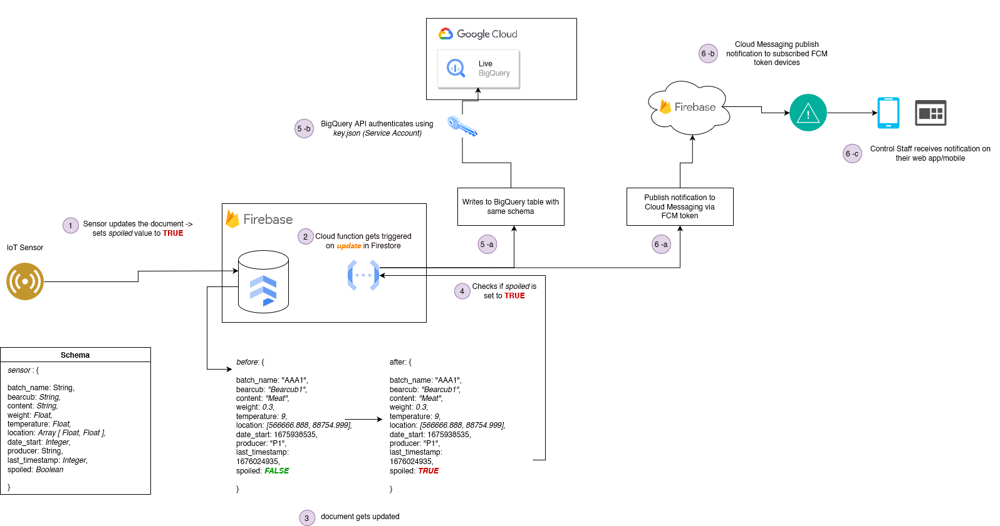
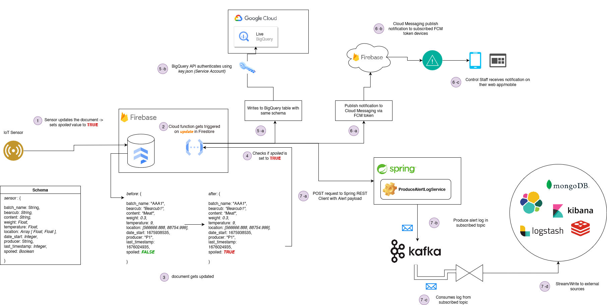

## FridgeGuard 🛡
#### The idea is generally to preserve food spoilage better for industries using event-driven alerting based approach.

This is an event-based system that triggers alert and stream ingestion in Google Cloud BigQuery when a sensor (such as ESP32) detects a spoil behaviour.

The trigger happens when a document (in a collection *'data'*) of Firebase Firestore instance gets updated. It then checks if the value of *spoiled* field is either *TRUE*. If it is, then it exports the data into a BigQuery table *'sensor'* inside *'data*' dataset with the same identical schema.

The system diagram below represents the complete flow from triggering event to data stream ingestion in BigQuery:

For accessing BigQuery API and bypassing authentication, it uses a *Service Based Account* approach in order to authenticate into Google Cloud project and BigQuery API. For this, you need to:

- Go to your Google Cloud console and search for *Service Account* under IAM section. 
- You need to create a new service account.
- After creating a new service account, you need to create a new *Key* for that service account.
- Once you created the *Key* then you need to download the *your_project_name.json* file (which will be automatically downloaded in your browser).
- Rename the credentials file with *key.json*
- Move *key.json* file under root folder of project
- BigQuery will automatically authenticate to your Google Cloud project.
- Once done, go to BigQuery and run a search query to query all the records.

Note that: For crucial security purpose, *key.json* file has been added to *.gitignore* as it contains your Google Cloud project credentials for access and authentication via client libraries.

### Implenting Kafka support for Storing Alert Log for aggregation and real-time streaming

The system is also capable to publish alert logs to Kafka topic when document gets updated in Firestore instance *data*. In makes a *POST* request call to Spring Kafka Client application with payload. The Kafka Client then publishes a new alert log in the Kafka topic *alerts* which can then be further consumed to perform write streams to external data sources.

The diagram below represents the entire flow:

